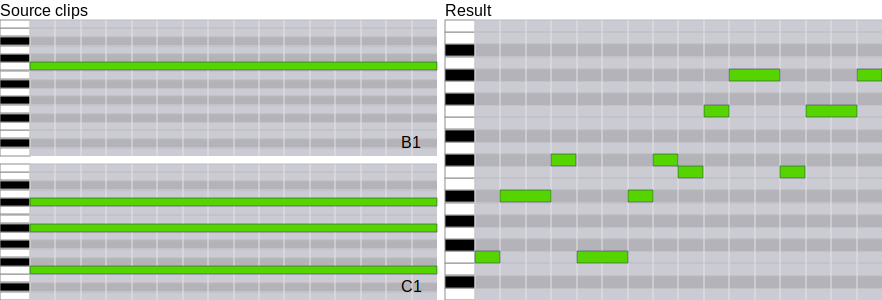
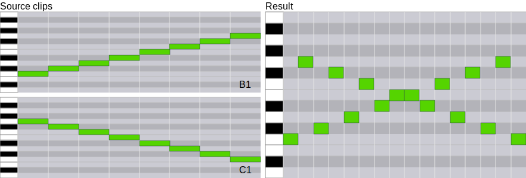
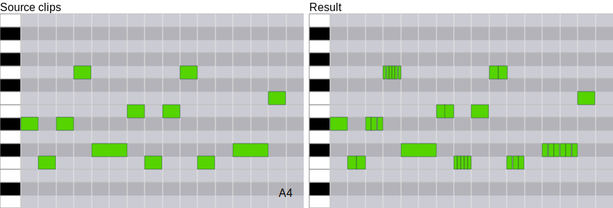
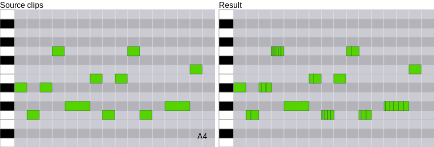

<h1 align="center"></h1>

**tl;dr:** `mutateful` enables live coding in Ableton Live's session view. Set up transformations that trigger whenever a source clip is changed, including arpeggiation, shuffling, and ratcheting/retriggering.

  

> With live coding being all the rage this looks like a groovy new idea to bring that excitement and its new possibilities to Ableton. I’m watching closely.
>
> &mdash; Matt Black, co-founder of Ninja Tune & Coldcut.

## Concept
`mutateful` reimagines Ableton Live's session view as a spreadsheet-like live coding setup. You add formulas to dynamically shuffle, arpeggiate, constrain, scale, retrigger, and otherwise transform clips in myriad ways. Formulas operate on other clips and/or textual inputs to produce new clips. Unlike most experimental sequencers, `mutateful` leverages Live's built-in sequencing functionality, allowing you to use any existing MIDI clip as a source of fresh inspiration.

## Installing

Go to the [latest release](https://github.com/carrierdown/mutateful/releases/latest) for installation instructions and download links for Windows and OS X.

<!---->

## Usage examples

### Creating an arpeggio from a sustained note and a chord

`=B1 slice 1/2 transpose 0 7 slice 1/16 1/8 transpose -by C1`

This formula does the following: Start with the single sustained note contained in the clip at position `B1`. Slice it in half, keeping the first note unchanged and transposing the second note 7 semitones up (a perfect fifth). Now, slice the resulting two half-notes into a pattern alternating between 1/16 and 1/8th notes. Finally, transpose this pattern with the chord contained in the clip located at position `C1`.

### Interleaving two clips together

`=B1 C1 interleave -mode event`

This formula combines the notes contained in the clips located at positions `B1` and `C1`, so that the notes from each clip are played one after the other in an alternating fashion.

### Adding retriggering to a beat

`=A4 ratchet 1 2 3 6 1 2 5`

This formula adds retriggering (also called ratchets) to the beat contained in clip `A4`. The numbers specify the retrigger amount for each note encountered in the clip. In this case, the first note in the clip will be divided into one (i.e. it will be kept as is), the second one will be divided into two, and so on. When the last number is reached it will loop back to the beginning if there are still unprocessed note events left in the clip. 

Ratchet accepts a number of other parameters to scale the resulting retriggers in various ways, including starting fast and going gradually slower towards the end of the note. This can be achieved by adding the `-shape` parameter and specifying EaseIn (the default is Linear). In addition, the resulting output can be tamed slightly by adding the `-strength` parameter and setting it to 0.5 (i.e. 50% strength):

`=a4 ratchet 1 2 3 6 1 2 5 -shape easein -strength 0.5`

<!--
 Formulas are composed of one or more commands operating on one or more clips. Most commands have various options that can be set depending on your specific needs. They range from simple things like filtering out all notes with a length shorter than a given interval, to more esoteric things like arpeggiating one clip based on another, or creating glitchy beats by adding ratcheting/retriggering to specific notes.
-->

## See it in action

<table cellpadding="0" cellspacing="0" style="border:none;"><tr><td><a href="https://www.youtube.com/watch?v=YNI9ZxhSkWQ">
Demo #1: concat, constrain, transpose
</a></td><td><a href="https://www.youtube.com/watch?v=bGMBDap1-ko">
Demo #2: ratchet, shuffle, interleave
</a></td></tr></table>

## A musical spreadsheet

The easiest way to understand what `mutateful` does is by comparing it to a traditional spreadsheet. Let's say you have two numbers that you'd like to multiply. You put one number in cell `A1`, another in `A2`, and in `A3` you enter the following (very simple) formula: `=A1 * A2`. Cell `A3` will then contain the result of this operation, and will update automatically whenever `A1` or `A2` changes. 

Since the session view in Ableton Live presents clips in a spreadsheet-like grid, `mutateful` works the same way, only with more musically interesting commands. For instance, you could shuffle the contents of clip `A1` using the contents of clip `A2`. The pitch values of the various notes in clip `A2` would then be used to shuffle the order of notes in `A1`. Similar to the example above, we would like the result to be inserted into clip `A3`, but instead of using a spreadsheet command we will use a `mutateful` command, as follows: `=A1 shuffle -by A2`. In this example, `A1` is a *source clip* (i.e. the clip that will be transformed), and `A2` is the *control clip* (i.e. the clip that controls the transformation). The latter could be omitted, in which case clip `A1` would be shuffled using itself as the control clip. The formula for this would simply be `=A1 shuffle`.

## Quick command reference

Command | Parameters (default values in **bold**) | Description
--- | --- | ---
arpeggiate | &#8209;rescale&nbsp;<[Number](#parameter-types): **2**> &#8209;removeoffset &#8209;by&nbsp;<[Clip reference](#parameter-types)> | Arpeggiates the given clip using another clip, or itself.
concat |  | Concatenates two or more clips together.
crop | <list of [Musical fraction](#parameter-types): **2**> | Crops a clip to the desired length, or within the desired region.
filter | <[Musical fraction](#parameter-types): **1/64**> &#8209;invert | Filters out notes shorter than the length specified (default 1/64). If -invert is specified, notes longer than the specified length are removed.
interleave | &#8209;chunkchords &#8209;solo &#8209;mode&nbsp;NotSpecified&#124;Event&#124;**Time** &#8209;ranges&nbsp;<list of [Musical fraction](#parameter-types): **1**> &#8209;repeats&nbsp;<list of [Number](#parameter-types): **1**> &#8209;skip | Combines notes from two or more clips in an interleaved fashion.
legato |  | Removes silence between notes. Basically the same as the built-in legato function in Live, but often useful in the context of a mutateful formula as well.
loop | <[Decimal number](#parameter-types): **1**> | Lengthens the incoming clips according to the factor specified (e.g. 2 would double the clip length)
mask | &#8209;by&nbsp;<[Clip reference](#parameter-types)> | Creates a masking clip which is used to remove or shorten notes not overlapping with the mask clip. If no -by clip is specified, a sustained note is used instead, effectively inversing the clip rhythmically.
monophonize |  | Makes the clip monophonic by removing any overlapping notes. Lower notes have precedence over higher notes.
padding | <[Musical fraction](#parameter-types): **2**> &#8209;length&nbsp;<[Musical fraction](#parameter-types): **-1**> &#8209;post | Adds silence (i.e. padding) at the start of a clip, or at the end of a clip if -post is specified. If -length is specified, padding is calculated so that the total length of the clip matches this. If length is shorter than the current clip length, the clip is cropped instead.
quantize | <list of [Musical fraction](#parameter-types): **1/16**> &#8209;amount&nbsp;<[Decimal number](#parameter-types): **1.0**> &#8209;by&nbsp;<[Clip reference](#parameter-types)> | Quantizes a clip by the specified amount against a regular or irregular set of divisions, or even against the timings of another clip.
ratchet | <list of [Number](#parameter-types)> &#8209;autoscale &#8209;by&nbsp;<[Clip reference](#parameter-types)> &#8209;mode&nbsp;Velocity&#124;**Pitch** &#8209;shape&nbsp;**Linear**&#124;EaseInOut&#124;EaseIn&#124;EaseOut &#8209;strength&nbsp;<[Decimal number](#parameter-types): **1.0**> &#8209;velocitytostrength | Creates retriggers/ratchets in the current clip, based on a sequence of passed in values or another clip. The ratchets produced can be scaled and shaped in various ways.
relength | <[Decimal number](#parameter-types): **1.0**> | Changes the length of all notes in a clip by multiplying their lengths with the specified factor.
remap | &#8209;to&nbsp;<[Clip reference](#parameter-types)> | Remaps a set of pitches to another set of pitches
resize | <[Decimal number](#parameter-types): **1.0**> | Resizes the current clip based on the specified factor (i.e. 0.5 halves the size of the clip, effectively doubling its tempo)
scale | &#8209;by&nbsp;<[Clip reference](#parameter-types)> &#8209;strict | Uses a clip passed in via the -by parameter as a scale to which the current clip is made to conform. If -strict is specified, notes are made to follow both the current pitch and octave of the closest matching note.
setlength | <list of [Musical fraction](#parameter-types): **1/16**> | Sets the length of all notes to the specified value(s). When more values are specified, they are cycled through.
setpitch | <list of [Number](#parameter-types)> &#8209;by&nbsp;<[Clip reference](#parameter-types)> | Sets the pitch of all notes to the specified value(s). When more values are specified, they are cycled through.
setrhythm | &#8209;by&nbsp;<[Clip reference](#parameter-types)> | Retains pitch and velocity from the current clip while changing the timing and duration to match the clip specified in the -by parameter.
shuffle | <list of [Number](#parameter-types)> &#8209;by&nbsp;<[Clip reference](#parameter-types)> | Shuffles the order of notes by a list of numbers of arbitrary length, or by another clip. When another clip is specified, the relative pitch of each note is used to determine the shuffle order.
skip | <list of [Number](#parameter-types): **2**> | Creates a new clip by skipping every # note from another clip. If more than one skip value is specified, they are cycled through.
slice | <list of [Musical fraction](#parameter-types): **1/16**> | Slices a clip (i.e. cutting any notes) at a regular or irregular set of fractions.
take | <list of [Number](#parameter-types): **2**> | Creates a new clip by taking every # note from another clip. If more than one skip value is specified, they are cycled through.
transpose | <list of [Number](#parameter-types)> &#8209;by&nbsp;<[Clip reference](#parameter-types)> &#8209;mode&nbsp;**Absolute**&#124;Relative | Transposes the notes in a clip based on either a set of passed-in values, or another clip.
velocityscale | <[Musical fraction](#parameter-types)> | Scale a clips notes' velocities.

## Parameter types

Type | Description
--- | ---
Clip reference | Cells in the session view are referenced like they would be in a spreadsheet, i.e. tracks are assigned letters (A-Z) and clip rows are assigned numbers (1-N). Example: track 1 clip 1 becomes A1, track 2 clip 3 becomes B3.
Musical fraction | These are commonly used in sequencer software to denote musical fractions like quarter notes, eight notes and so on. Examples: quarter note = 1/4, eighth note = 1/8.
Number | Whole number (integer), either negative or positive
Decimal number | Decimal number, from 0.0 and upwards

## Full documentation

I've started adding more in-depth documentation in our [wiki](https://github.com/carrierdown/mutateful/wiki). There's still a long way to go, though.

Be sure to star this repo and/or follow me at [twitter.com/KnUpland](https://twitter.com/KnUpland) for updates.

## Compiling from source

### Pre-requisites

- Git
- .NET Core 3 SDK

### Building

Using the command line/terminal, navigate to the src folder inside the mutateful repository and run:

Windows: `dotnet publish -c Release` 
MacOS / OS X: `dotnet publish -c Release /p:RuntimeIdentifier=osx-x64 /p:PublishTrimmed=false`
